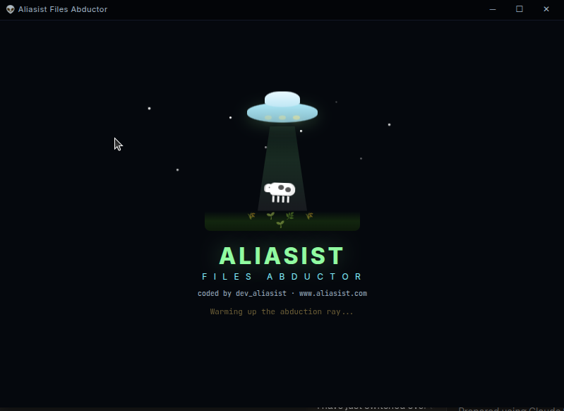

[README.md](https://github.com/user-attachments/files/26153569/README.md)
# 🛸 Aliasist Abductor

**Aliasist Abductor** is a high-performance media utility designed to streamline the process of fetching and archiving digital content (Audio, Video, and Images) from the web.

## 🌟 Key Features

* **Universal Media Fetching:** Intelligent detection and downloading of `.mp4`, `.mp3`, and high-res image formats.
* **SPA-Optimized Routing:** Custom-built routing logic for Cloudflare Pages to ensure seamless navigation.
* **Performance-First UI:** Refactored CSS animations and a lightweight TypeScript core for near-instant interaction speeds.
* **Modern Theme Engine:** Persistent dark/light mode toggle that respects user system preferences.

---

## 🛠️ Tech Stack

| Category | Technology |
| :--- | :--- |
| **Frontend** | React 19 / TypeScript |
| **Build Tool** | Vite |
| **Styling** | Tailwind CSS / PostCSS |
| **Deployment** | Cloudflare Pages |

---

## 🧠 Technical Case Study

### The Challenge: Cloudflare SPA Routing
Deploying a Single Page Application (SPA) to Cloudflare often results in `404 Not Found` errors when a user refreshes a sub-page. 

**The Solution:** I implemented a robust routing configuration within `vite.config.ts` and utilized Cloudflare's redirect rules to ensure all requests are handled by `index.html`. This allows the client-side router to maintain state without server-side interruptions.

### Performance Optimization
To ensure a premium user experience, I used an AI-assisted workflow to refactor the animation logic in `index.css`. This offloaded the repetitive task of writing browser-specific keyframes, allowing me to focus on the core downloading engine.

---

## 📦 Getting Started

1. **Clone:** `git clone https://github.com/aliasist/aliasistabductor.git`
2. **Install:** `npm install`
3. **Run:** `npm run dev`

---

## 👤 Author
**Blake Hooper**
* [Portfolio Website](https://your-portfolio-link.com)
* [GitHub](https://github.com/aliasist)

---
*Disclaimer: This tool is for personal archival of legally accessible media. Please respect digital rights management (DRM) and platform Terms of Service.*
